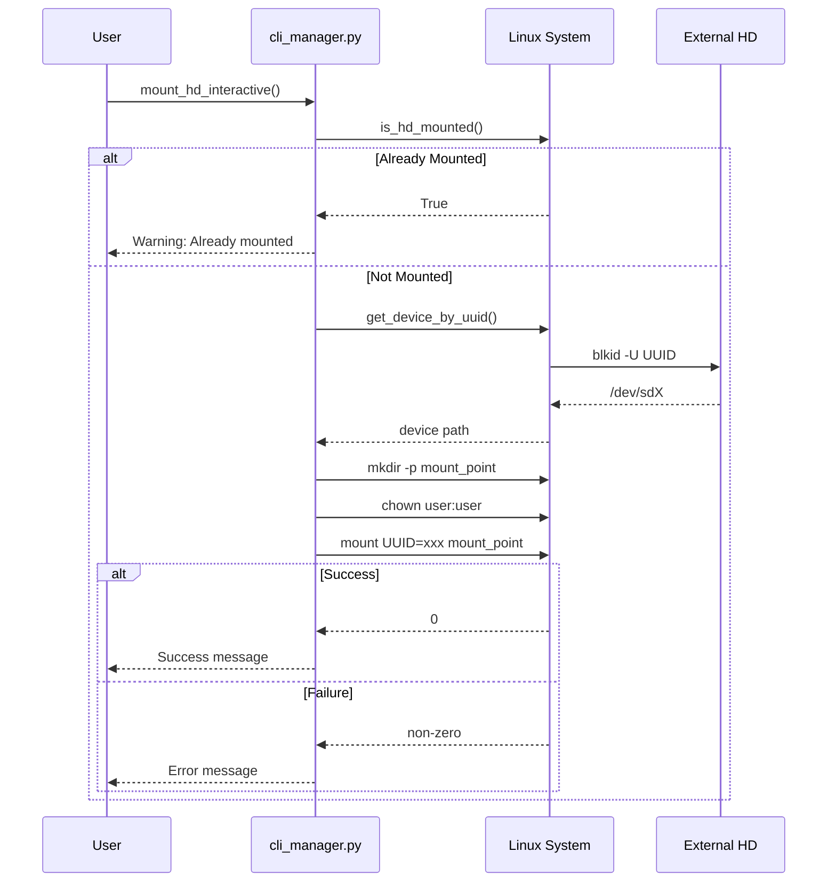
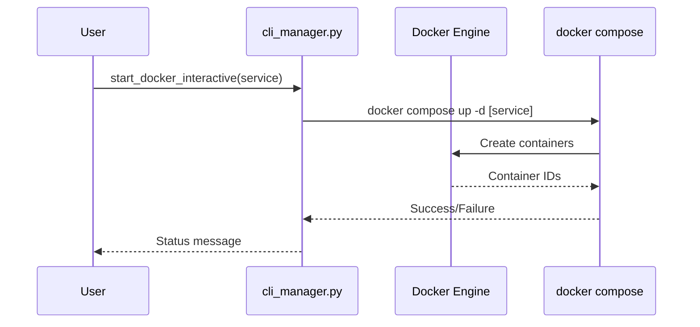
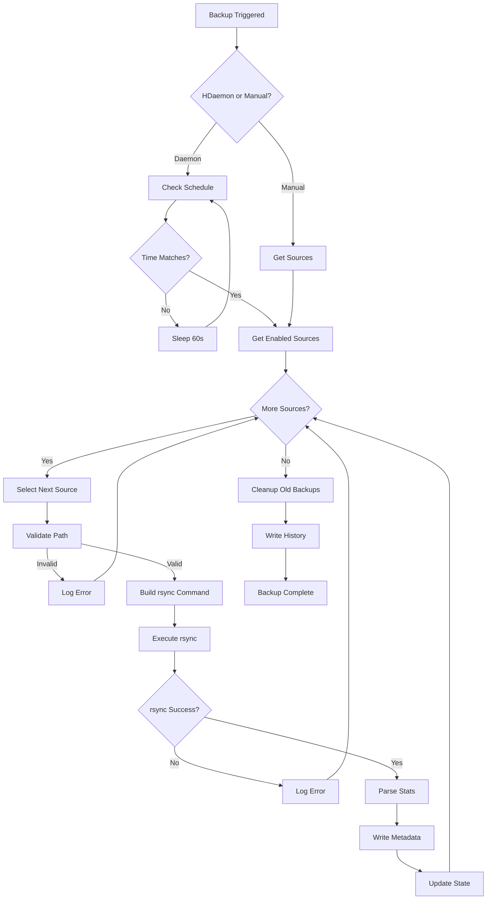
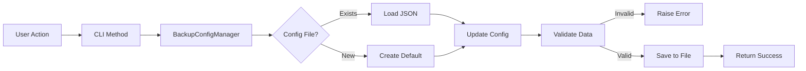
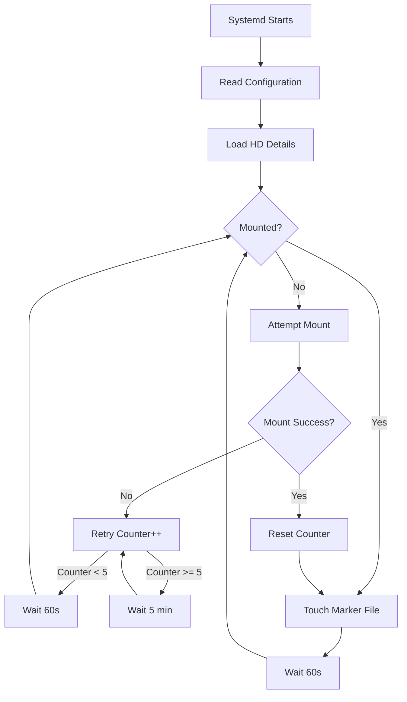

# Control Panel Documentation Implementation Plan

**Goal:** Create comprehensive technical documentation for the Control Panel project using MkDocs, GitHub Actions, and GitHub Pages.

**Architecture:** Create a modular documentation structure with MkDocs that covers architecture, module documentation, system flows, and API references. Use GitHub Actions for CI/CD with automatic deployment to GitHub Pages.

**Tech Stack:** MkDocs, Material for MkDocs, GitHub Actions, Python docstrings, Mermaid diagrams

---

## Task 1: Create MkDocs Configuration

**Files:**
- Create: `mkdocs.yml`

```yaml
site_name: Control Panel Documentation
site_description: Server management system for HD and Docker containers
site_author: mateus
site_url: https://mateus.github.io/control-panel

repo_name: mateus/control-panel
repo_url: https://github.com/mateus/control-panel

theme:
  name: material
  palette:
    - scheme: default
      primary: indigo
      accent: blue
      toggle:
        icon: material/brightness-7
        name: Switch to dark mode
    - scheme: slate
      primary: blue
      accent: indigo
      toggle:
        icon: material/brightness-4
        name: Switch to light mode
  features:
    - navigation.tabs
    - navigation.sections
    - navigation.expand
    - search.suggest
    - search.highlight
    - content.tabs.link
    - content.code.copy
  font:
    text: Roboto
    code: Roboto Mono

plugins:
  - search
  - mkdocstrings:
      handlers:
        python:
          options:
            docstring_style: google
            show_source: true
  - mermaid2

markdown_extensions:
  - pymdownx.highlight:
      anchor_linenums: true
  - pymdownx.inlinehilite
  - pymdownx.snippets
  - pymdownx.superfences:
      custom_fences:
        - name: mermaid
          class: mermaid
          format: !!python/name:mermaid2.fence_mermaid
  - admonition
  - pymdownx.details
  - pymdownx.mark

extra:
  social:
    - icon: fontawesome/brands/github
      link: https://github.com/mateus
  generator: false

nav:
  - Home: index.md
  - Getting Started:
    - getting-started/installation.md
    - getting-started/quick-start.md
    - getting-started/configuration.md
  - Architecture:
    - architecture/overview.md
    - architecture/modules.md
    - architecture/data-flow.md
  - Reference:
    - reference/cli.md
    - reference/backup-subsystem.md
    - reference/configuration-ref.md
  - Guides:
    - guides/hd-management.md
    - guides/docker-management.md
    - guides/backup-guide.md
    - guides/systemd-services.md
  - API:
    - api/modules.md
```

---

## Task 2: Create GitHub Actions Workflow

**Files:**
- Create: `.github/workflows/docs.yml`

```yaml
name: Deploy Documentation
on:
  push:
    branches:
      - main
      - master
  workflow_dispatch:

permissions:
  contents: read
  pages: write
  id-token: write

concurrency:
  group: "pages"
  cancel-in-progress: false

jobs:
  build:
    runs-on: ubuntu-latest
    steps:
      - name: Checkout
        uses: actions/checkout@v4
        with:
          fetch-depth: 0

      - name: Setup Python
        uses: actions/setup-python@v5
        with:
          python-version: '3.12'

      - name: Install Dependencies
        run: |
          python -m pip install --upgrade pip
          pip install mkdocs-material mkdocstrings-python mermaid2

      - name: Build Documentation
        run: mkdocs build --strict --site-dir build

      - name: Setup Pages
        uses: actions/configure-pages@v4

      - name: Upload artifact
        uses: actions/upload-pages-artifact@v3
        with:
          path: build

  deploy:
    environment:
      name: github-pages
      url: ${{ steps.deployment.outputs.page_url }}
    runs-on: ubuntu-latest
    needs: build
    steps:
      - name: Deploy to GitHub Pages
        id: deployment
        uses: actions/deploy-pages@v4
```

---

## Task 3: Create Documentation Home Page

**Files:**
- Create: `docs/index.md`

```markdown
# Control Panel - Server Management System

A comprehensive server management system for home servers, providing unified control over external HD drives and Docker containers through an interactive CLI interface.

## Features

- **HD Management**: Mount/unmount external drives with UUID-based detection, keepalive monitoring
- **Docker Container Management**: Start/stop/restart containers, view logs, pull images
- **Backup Subsystem**: Automated incremental backups with rsync and hard links
- **Systemd Integration**: Keepalive and backup daemon services
- **Interactive CLI**: Rich terminal UI with menus and colored output

## Quick Start

```bash
# Install (creates symlink)
./control-panel sync

# Interactive menu
control-panel

# Mount HD
control-panel mount

# Start Docker containers
control-panel start

# View status
control-panel status
```

## Architecture

The system consists of several Python modules organized by responsibility:

| Module | Purpose |
|--------|---------|
| `cli_manager.py` | Main CLI entry point with interactive menus |
| `backup_cli.py` | Backup subsystem command-line interface |
| `backup_manager.py` | Backup execution with rsync |
| `backup_config.py` | Configuration and state persistence |
| `backup_daemon.py` | Background backup scheduler |
| `log_config.py` | Centralized logging with rotation |

## Documentation

- [Installation Guide](getting-started/installation.md)
- [Quick Start](getting-started/quick-start.md)
- [Architecture Overview](architecture/overview.md)
- [CLI Reference](reference/cli.md)
- [Backup System Guide](guides/backup-guide.md)
```

---

## Task 4: Create Architecture Documentation

**Files:**
- Create: `docs/architecture/overview.md`

```markdown
# Architecture Overview

## System Design

The Control Panel follows a **layered architecture** with clear separation of concerns:

```
┌─────────────────────────────────────────────────────────────┐
│  Entry Points                                                │
│  ├── control-panel (Bash wrapper → Python CLI)               │
│  ├── control_panel.sh (Legacy compatibility)                 │
│  └── Python CLI (cli_manager.py)                            │
├─────────────────────────────────────────────────────────────┤
│  CLI Layer (cli_manager.py)                                 │
│  └── Rich-based interactive menus                           │
├─────────────────────────────────────────────────────────────┤
│  Backup Subsystem                                           │
│  ├── backup_cli.py      (CLI interface)                     │
│  ├── backup_manager.py  (Business logic - rsync execution)  │
│  ├── backup_config.py   (Configuration persistence)         │
│  └── backup_daemon.py   (Background scheduler)              │
├─────────────────────────────────────────────────────────────┤
│  Infrastructure                                             │
│  ├── log_config.py      (Logging with rotation)            │
│  ├── log_formatter.py   (Structured log formatting)        │
│  ├── Docker             (Container platform)                │
│  └── systemd            (Service management)                │
└─────────────────────────────────────────────────────────────┘
```

## Key Design Decisions

### 1. Dual Entry Points

The system uses both Bash and Python:
- **Bash** (`control_panel.sh`): Legacy compatibility, simple commands, systemd integration
- **Python** (`cli_manager.py`): Interactive menus, complex logic, Rich UI

### 2. Backup Strategy

The backup subsystem uses **rsync with hard links** for efficient incremental backups:

- First backup: Full copy
- Subsequent backups: Hard links to unchanged files
- Only modified files consume additional disk space

### 3. Configuration Storage

Configuration is stored in `~/.local/share/control-panel/` following XDG Base Directory Specification:

```
~/.local/share/control-panel/
├── backup/
│   ├── .backup_config       # Main configuration
│   ├── .backup_state.json   # Runtime state
│   ├── backup_history.json  # Backup records
│   └── .daemon.pid        # Daemon PID file
└── control_panel.log        # Application logs
```

### 4. Service Architecture

Two systemd services manage background operations:

| Service | Purpose | Trigger |
|---------|---------|---------|
| `panel-keepalive.service` | Keep HD active, auto-remount | Always running |
| `backup-daemon.service` | Scheduled backups | Timer-based |

## Technology Stack

| Component | Technology | Purpose |
|-----------|------------|---------|
| Primary Language | Python 3.12 | Core logic |
| UI Framework | Rich | Terminal UI |
| Backup Tool | rsync | File synchronization |
| Container Platform | Docker | Service isolation |
| Service Manager | systemd | Background services |
| Logging | logging + RotatingFileHandler | Log rotation |

## Docker Services Managed

| Service | Image | Purpose |
|---------|-------|---------|
| nextcloud | linuxserver/nextcloud | Cloud storage |
| nextcloud-db | postgres:15-alpine | Nextcloud database |
| nextcloud-redis | redis:7-alpine | Nextcloud cache |
| onlyoffice | onlyoffice/documentserver | Document editing |
| kavita | jvmilazz0/kavita | E-book reader |
| navidrome | deluan/navidrome | Music streaming |
```

---

## Task 5: Create Module Documentation

**Files:**
- Create: `docs/architecture/modules.md`

```markdown
# Module Reference

## Module Relationships

```mermaid
graph TB
    subgraph CLI
        CLI[cli_manager.py]
        BACKUP_CLI[backup_cli.py]
    end

    subgraph Backup
        BACKUP_MGR[backup_manager.py]
        BACKUP_CONFIG[backup_config.py]
        BACKUP_DAEMON[backup_daemon.py]
    end

    subgraph Logging
        LOG_CONFIG[log_config.py]
        LOG_FORMATTER[log_formatter.py]
    end

    CLI --> BACKUP_CLI
    BACKUP_CLI --> BACKUP_MGR
    BACKUP_CLI --> BACKUP_DAEMON
    BACKUP_CLI --> BACKUP_CONFIG
    BACKUP_DAEMON --> BACKUP_MGR
    BACKUP_DAEMON --> BACKUP_CONFIG
    BACKUP_MGR --> BACKUP_CONFIG
    CLI --> LOG_CONFIG
    BACKUP_CLI --> LOG_CONFIG
    BACKUP_DAEMON --> LOG_CONFIG
    BACKUP_MGR --> LOG_CONFIG
    LOG_CONFIG --> LOG_FORMATTER
```

## cli_manager.py

**Purpose:** Main entry point providing interactive CLI menus using Rich library.

**Key Classes:**
- `CLIManager`: Main CLI controller

**Key Methods:**
| Method | Description |
|--------|-------------|
| `show_interactive_menu()` | Display main menu loop |
| `show_docker_menu()` | Docker management submenu |
| `show_backup_menu()` | Backup subsystem submenu |
| `show_hd_menu()` | HD drive management submenu |
| `show_systemd_menu()` | Systemd service management submenu |
| `mount_hd_interactive()` | Mount external drive |
| `unmount_hd_interactive()` | Unmount external drive |
| `start_docker_interactive()` | Start Docker containers |
| `stop_docker_interactive()` | Stop Docker containers |
| `keepalive_hd_interactive()` | Monitor and keep HD active |

**Configuration:**
```python
hd_mount_point = "/media/mateus/Servidor"
hd_uuid = "35feb867-8ee2-49a9-a1a5-719a67e3975a"
hd_label = "Servidor"
docker_compose_dir = Path("/home/mateus")
```

---

## backup_cli.py

**Purpose:** Command-line interface for backup subsystem.

**Key Classes:**
- `BackupCLI`: Backup command handler

**Key Methods:**
| Method | Description |
|--------|-------------|
| `daemon_start/stop/restart()` | Manage backup daemon |
| `set_destination()` | Configure backup location |
| `add_source()` / `remove_source()` | Manage backup sources |
| `list_sources()` | List configured sources |
| `run_backup()` | Execute manual backup |
| `show_stats()` / `show_history()` | View backup information |
| `set_schedule()` / `set_retention()` | Configure policies |

---

## backup_manager.py

**Purpose:** Core backup execution logic using rsync.

**Key Classes:**
- `BackupManager`: Backup orchestration

**Key Methods:**
| Method | Description |
|--------|-------------|
| `run_backup(source)` | Execute backup for source(s) |
| `_get_backup_type()` | Determine daily/weekly/monthly |
| `_should_backup_now()` | Check if backup should run |
| `_parse_rsync_stats()` | Parse backup statistics |
| `cleanup_old_backups()` | Apply retention policy |
| `verify_backup()` | Validate backup integrity |
| `restore_file()` / `restore_directory()` | Restore from backup |

**Backup Types:**
- `daily`: Regular backups (all other days)
- `weekly`: Sunday backups
- `monthly`: 1st of month backups

---

## backup_config.py

**Purpose:** Configuration persistence and management.

**Key Classes:**
- `BackupDestination`: Destination configuration dataclass
- `BackupSchedule`: Schedule configuration dataclass
- `RetentionPolicy`: Retention configuration dataclass
- `BackupConfigManager`: Configuration CRUD operations

**Key Methods:**
| Method | Description |
|--------|-------------|
| `set_backup_destination()` | Set backup location |
| `set_schedule()` | Configure global schedule |
| `set_retention()` | Configure retention policy |
| `add_source()` / `remove_source()` | Manage sources |
| `get_enabled_sources()` | Get active sources |
| `set_source_schedule()` | Per-source schedule |
| `set_source_retention()` | Per-source retention |
| `get_history()` | Retrieve backup history |
| `check_destination_space()` | Verify available space |

**Config Location:** `~/.local/share/control-panel/backup/.backup_config`

---

## backup_daemon.py

**Purpose:** Background service for scheduled backups.

**Key Classes:**
- `BackupDaemon`: Background scheduler

**Key Methods:**
| Method | Description |
|--------|-------------|
| `run()` | Main daemon loop |
| `_should_run_backup()` | Check if source should backup |
| `_calculate_sleep_time()` | Compute until next backup |
| `is_running()` | Check daemon status |
| `stop()` | Graceful shutdown |

**Daemon Loop:**
1. Write PID to file
2. Update state to "running"
3. Check each enabled source
4. Run backup if scheduled time matches
5. Sleep until next check (max 60 seconds)
6. Repeat

---

## log_config.py

**Purpose:** Centralized logging with rotation.

**Key Functions:**
| Function | Description |
|----------|-------------|
| `get_logger(name)` | Get or create logger instance |
| `log_success/error/warning/info()` | Formatted logging helpers |
| `log_mount/docker/systemd()` | Domain-specific logging |
| `set_request_id()` | Enable operation tracking |
| `is_verbose_logging()` | Check DEBUG level |
| `set_console_log_level()` | Suppress console output |

**Log Files:**
- Console: Rich-formatted output
- File: `~/.local/share/control-panel/control_panel.log`
- Rotation: 10MB max, 5 backup files

---

## log_formatter.py

**Purpose:** Structured log formatting utilities.

**Key Classes:**
- `LogSection`: Hierarchical log formatter
- `LogBuilder`: Fluent log builder

**Key Methods (LogSection):**
| Method | Description |
|--------|-------------|
| `major_header()` | Section header (level 1) |
| `minor_header()` | Subsection header (level 2) |
| `section()` | Multi-item section |
| `inline_section()` | Compact inline section |
| `progress_line()` | Progress indicator |
| `error_block()` | Error display |
| `format_duration()` | Human-readable duration |
| `format_size()` | Human-readable file size |
```

---

## Task 6: Create Data Flow Documentation

**Files:**
- Create: `docs/architecture/data-flow.md`

```markdown
# Data Flow

## HD Mount Flow



## Docker Container Management Flow



## Backup Execution Flow



## Configuration Persistence Flow



## Keepalive Service Flow


```

---

## Task 7: Create Getting Started Documentation

**Files:**
- Create: `docs/getting-started/installation.md`

```markdown
# Installation Guide

## Prerequisites

- Python 3.12+
- Docker and Docker Compose
- rsync
- systemd (for background services)
- External HD with ext4 filesystem

## Installation Steps

### 1. Clone or Copy the Repository

```bash
git clone https://github.com/mateus/control-panel.git
cd control-panel
```

### 2. Run Initial Sync

The `sync` command copies scripts to `~/scripts/` and creates a global symlink:

```bash
./control_panel.sh sync
```

This will:
- Create `~/scripts/` directory
- Copy Python scripts to `~/scripts/`
- Create symlink at `~/.local/bin/control-panel`
- Verify installation

### 3. Verify Installation

```bash
control-panel status
```

### 4. Install Systemd Services (Optional)

For automatic keepalive:

```bash
sudo ln -s /path/to/control-panel/panel-keepalive.service /etc/systemd/system/
sudo systemctl enable panel-keepalive.service
sudo systemctl start panel-keepalive.service
```

For automatic backups:

```bash
sudo ln -s /path/to/control-panel/backup-daemon.service /etc/systemd/system/
sudo systemctl enable backup-daemon.service
sudo systemctl start backup-daemon.service
```

## Configuration

Edit configuration in `scripts/cli_manager.py`:

```python
self.hd_mount_point = "/media/mateus/Servidor"
self.hd_uuid = "35feb867-8ee2-49a9-a1a5-719a67e3975a"
self.hd_label = "Servidor"
self.docker_compose_dir = Path("/home/mateus")
```

Or in `scripts/backup_config.py` for backup settings.

## Docker Setup

Ensure your `docker-compose.yml` is in the configured directory with your services defined.

## Troubleshooting

### Python Import Errors

Ensure you're using the correct Python path:

```bash
which python3
./venv/bin/python3 scripts/cli_manager.py
```

### Permission Denied

The script uses `sudo` for mount operations. Ensure your user has sudo access without password prompt for specific commands, or add your user to appropriate groups.
```

**Files:**
- Create: `docs/getting-started/quick-start.md`

```markdown
# Quick Start Guide

## Common Operations

### Starting the Server

```bash
# Mount external HD
control-panel mount

# Start all Docker containers
control-panel start

# Check status
control-panel status
```

### Stopping the Server

```bash
# Stop all Docker containers
control-panel stop

# Unmount HD (waits for sync)
control-panel unmount
```

### Interactive Menu

For a menu-driven interface:

```bash
control-panel
```

This opens an interactive menu with all available operations.

### Managing Docker Containers

```bash
# Start specific service
control-panel start nextcloud

# Stop specific service
control-panel stop navidrome

# Restart with clean containers
control-panel restart kavita --clean

# View logs
control-panel logs onlyoffice -f

# Check health
control-panel health
```

### Managing Backups

```bash
# View backup status
control-panel backup stats

# Run backup now
control-panel backup run

# Add new source
control-panel backup add-source /path/to/data \
  --frequency daily --time 02:00 --priority high
```

### Viewing Logs

```bash
# View script logs
control-panel view-logs 100

# Follow Docker logs
control-panel logs nextcloud -f

# Systemd logs
sudo journalctl -u panel-keepalive.service -f
```

## Keyboard Shortcuts

In interactive menu:
- `Ctrl+C`: Cancel current operation
- `Enter`: Confirm selection
- Numbers `1-9`: Direct menu selection
```

---

## Task 8: Create Backup Guide Documentation

**Files:**
- Create: `docs/guides/backup-guide.md`

```markdown
# Backup System Guide

## Overview

The backup subsystem provides automated incremental backups using rsync with hard links. Each source can have individual schedules and retention policies.

## Concepts

### Backup Types

| Type | Trigger | Use Case |
|------|---------|----------|
| **Daily** | Every day except Sunday and 1st of month | Regular backups |
| **Weekly** | Every Sunday | Weekly snapshots |
| **Monthly** | 1st of every month | Long-term archives |

### Incremental Backups with Hard Links

The first backup creates a full copy. Subsequent backups use hard links for unchanged files, meaning:
- Only modified files consume additional disk space
- Each backup appears as a complete filesystem
- Deleting any backup won't affect others

### Retention Policy

Automatically removes old backups based on:
- Count limits (daily/weekly/monthly)
- Maximum age in days
- Minimum free space requirement

## Configuration

### Set Backup Destination

```bash
control-panel backup set-destination /media/mateus/Servidor backups
```

### Configure Global Schedule

```bash
# Daily at 2:00 AM
control-panel backup set-schedule --frequency daily --time 02:00

# Weekly on Sunday at 3:00 AM
control-panel backup set-schedule --frequency weekly --time 03:00 --day-of-week sunday

# Specific days (Mon, Wed, Fri)
control-panel backup set-schedule --frequency custom --time 02:00 --days mon,wed,fri
```

### Configure Global Retention

```bash
control-panel backup set-retention \
  --daily 7 \
  --weekly 4 \
  --monthly 6 \
  --max-age 180 \
  --min-space 10
```

## Managing Sources

### Add a Source

```bash
# Basic source
control-panel backup add-source /path/to/data

# Full options
control-panel backup add-source /path/to/data \
  --frequency daily \
  --time 02:00 \
  --priority high \
  --description "Important data" \
  --exclude "*.tmp,*.log,__pycache__" \
  --recursive
```

### List Sources

```bash
control-panel backup list-sources
```

### Remove a Source

```bash
control-panel backup remove-source /path/to/data
```

### Toggle Source

```bash
control-panel backup toggle-source /path/to/data
```

## Per-Source Configuration

### Individual Schedule

```bash
control-panel backup set-source-schedule /path/to/data \
  --frequency monthly \
  --time 04:00 \
  --day 1
```

### Individual Retention

```bash
control-panel backup set-source-retention /path/to/data \
  --daily 0 \
  --weekly 12 \
  --monthly 6 \
  --max-age 365
```

## Running Backups

### Manual Backup

```bash
# Backup all sources
control-panel backup run

# Backup specific source
control-panel backup run --source /path/to/data
```

### Daemon Mode

```bash
# Start daemon
control-panel backup daemon-start

# Check status
control-panel backup daemon-status

# Stop daemon
control-panel backup daemon-stop
```

## Monitoring

### View Statistics

```bash
control-panel backup stats
```

### View History

```bash
control-panel backup history --limit 20
```

### Check Destination Space

```bash
control-panel backup check-destination
```

## Storage Structure

```
<destination>/backups/
├── daily/
│   ├── backup-2026-04-01_02-00/
│   ├── backup-2026-04-02_02-00/
│   └── ...
├── weekly/
│   ├── backup-2026-03-30_03-00/
│   └── ...
├── monthly/
│   ├── backup-2026-04-01_04-00/
│   └── ...
└── logs/
```

Each backup directory contains:
- Backed up files with original structure
- `_metadata.json`: Backup statistics and status
```

---

## Task 9: Create CLI Reference

**Files:**
- Create: `docs/reference/cli.md`

```markdown
# CLI Reference

## Main Commands

### control-panel

Main entry point. Without arguments, starts interactive menu.

```bash
control-panel [command] [options]
```

### HD Management

| Command | Description |
|---------|-------------|
| `control-panel mount` | Mount external HD |
| `control-panel unmount` | Unmount HD (syncs first) |
| `control-panel status` | Show HD and Docker status |
| `control-panel check` | List active mounts |
| `control-panel fix` | Fix mount point permissions |
| `control-panel keepalive` | Manual keepalive mode |
| `control-panel force-mount` | Force remount sequence |

### Docker Management

| Command | Description |
|---------|-------------|
| `control-panel start [service]` | Start containers |
| `control-panel stop [service]` | Stop containers |
| `control-panel restart [service]` | Restart containers |
| `control-panel ps` | List running containers |
| `control-panel logs <service>` | View service logs |
| `control-panel stats [service]` | Show resource usage |
| `control-panel health` | Check container health |

### Docker Maintenance

| Command | Description |
|---------|-------------|
| `control-panel services` | List available services |
| `control-panel pull` | Pull updated images |
| `control-panel rebuild [service]` | Rebuild containers |
| `control-panel update-all` | Smart update |
| `control-panel networks` | List Docker networks |
| `control-panel volumes` | List Docker volumes |
| `control-panel prune` | Clean unused resources |

### Backup Subsystem

| Command | Description |
|---------|-------------|
| `control-panel backup daemon-start` | Start backup daemon |
| `control-panel backup daemon-stop` | Stop backup daemon |
| `control-panel backup daemon-status` | Check daemon status |
| `control-panel backup set-destination <path>` | Set backup location |
| `control-panel backup list-sources` | List backup sources |
| `control-panel backup add-source <path>` | Add backup source |
| `control-panel backup remove-source <path>` | Remove source |
| `control-panel backup run` | Run backup now |
| `control-panel backup stats` | Show backup statistics |
| `control-panel backup history` | Show backup history |
| `control-panel backup config` | Show configuration |

### Systemd Services

| Command | Description |
|---------|-------------|
| `control-panel keepalive-status` | Check keepalive service |
| `control-panel keepalive-start` | Start keepalive |
| `control-panel keepalive-stop` | Stop keepalive |
| `control-panel keepalive-restart` | Restart keepalive |
| `control-panel keepalive-logs [-f]` | View logs |
| `control-panel service-<action> <name>` | Manage any service |

### Utilities

| Command | Description |
|---------|-------------|
| `control-panel view-logs [n]` | View script logs |
| `control-panel sync` | Sync scripts to ~/scripts |
| `control-panel diagnose` | Full diagnostic |

## Options

### Global Options

| Option | Description |
|--------|-------------|
| `-h, --help` | Show help |
| `--version` | Show version |

### Service Options

| Option | Description |
|--------|-------------|
| `--clean` | Remove old containers |
| `--no-deps` | Skip dependencies |
| `--cache` | Use build cache |

### Backup Options

| Option | Description |
|--------|-------------|
| `--frequency` | Backup frequency |
| `--time` | Backup time (HH:MM) |
| `--recursive` | Include subdirectories |
| `--exclude` | Exclude patterns |
```

---

## Task 10: Update README.md

**Files:**
- Modify: `README.md`

Add a banner pointing to the full documentation at the top of the file.
