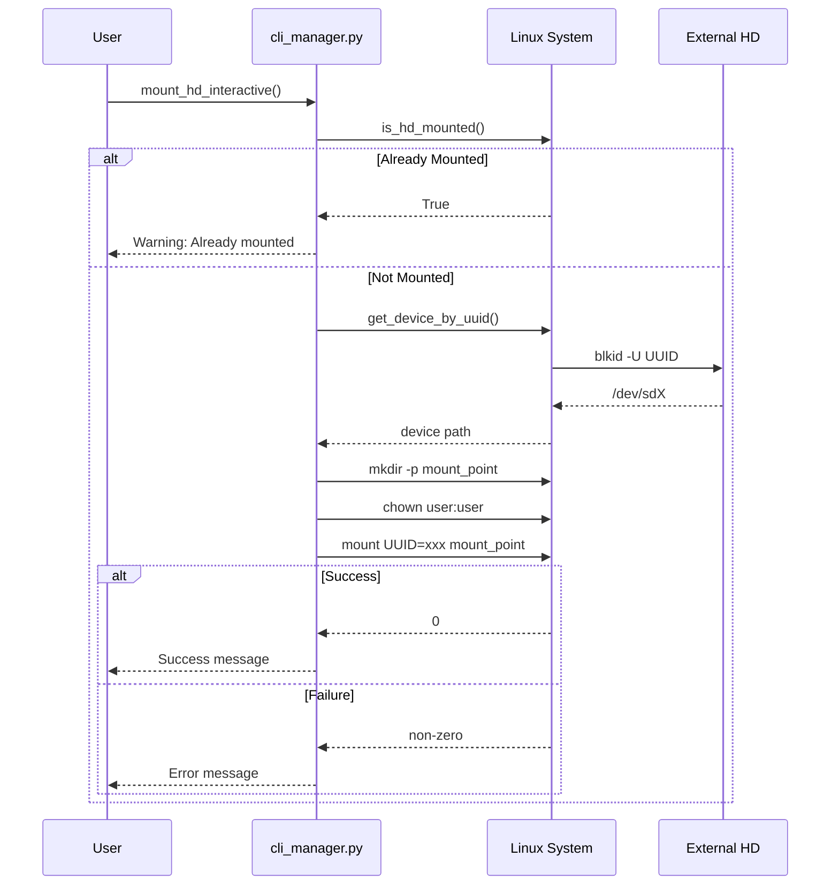
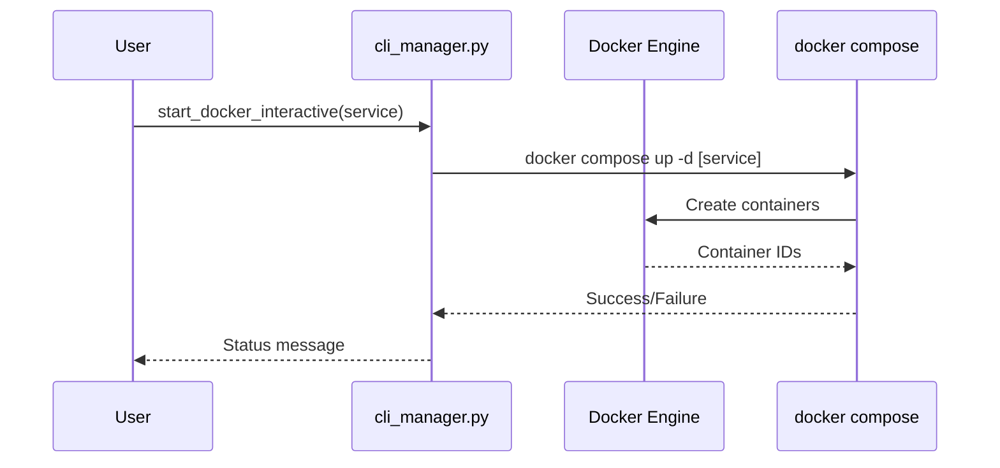
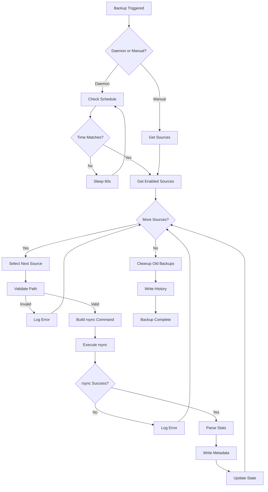
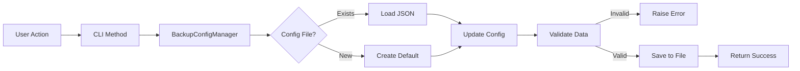
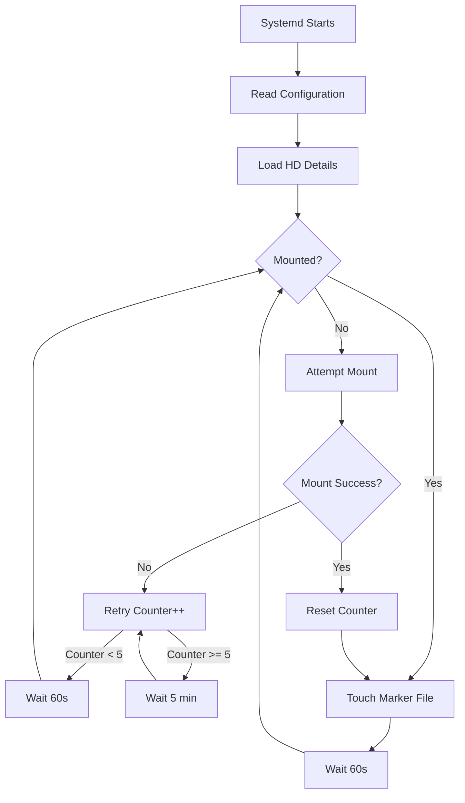

# Data Flow

## HD Mount Flow

```mermaid
sequenceDiagram
    participant User
    participant CLI as cli_manager.py
    participant System as Linux System
    participant HD as External HD

    User->>CLI: mount_hd_interactive()
    CLI->>System: is_hd_mounted()
    alt Already Mounted
        System-->>CLI: True
        CLI-->>User: Warning: Already mounted
    else Not Mounted
        CLI->>System: get_device_by_uuid()
        System->>HD: blkid -U UUID
        HD-->>System: /dev/sdX
        System-->>CLI: device path
        CLI->>System: mkdir -p mount_point
        CLI->>System: chown user:user
        CLI->>System: mount UUID=xxx mount_point
        alt Success
            System-->>CLI: 0
            CLI-->>User: Success message
        else Failure
            System-->>CLI: non-zero
            CLI-->>User: Error message
        end
    end
```

## Docker Container Management Flow

```mermaid
sequenceDiagram
    participant User
    participant CLI as cli_manager.py
    participant Docker as Docker Engine
    participant Compose as docker compose

    User->>CLI: start_docker_interactive(service)
    CLI->>Compose: docker compose up -d [service]
    Compose->>Docker: Create containers
    Docker-->>Compose: Container IDs
    Compose-->>CLI: Success/Failure
    CLI-->>User: Status message
```

## Backup Execution Flow

```mermaid
flowchart TD
    A[Backup Triggered] --> B{Daemon or Manual?}
    B -->|Daemon| C[Check Schedule]
    B -->|Manual| D[Get Sources]
    C --> E{Time Matches?}
    E -->|No| F[Sleep 60s]
    F --> C
    E -->|Yes| G[Get Enabled Sources]
    D --> G
    G --> H{More Sources?}
    H -->|Yes| I[Select Next Source]
    I --> J[Validate Path]
    J -->|Invalid| K[Log Error]
    K --> H
    J -->|Valid| L[Build rsync Command]
    L --> M[Execute rsync]
    M --> N{rsync Success?}
    N -->|No| O[Log Error]
    O --> H
    N -->|Yes| P[Parse Stats]
    P --> Q[Write Metadata]
    Q --> R[Update State]
    R --> H
    H -->|No| S[Cleanup Old Backups]
    S --> T[Write History]
    T --> U[Backup Complete]
```

## Configuration Persistence Flow

```mermaid
flowchart LR
    A[User Action] --> B[CLI Method]
    B --> C[BackupConfigManager]
    C --> D{Config File?}
    D -->|Exists| E[Load JSON]
    D -->|New| F[Create Default]
    E --> G[Update Config]
    F --> G
    G --> H[Validate Data]
    H -->|Invalid| I[Raise Error]
    H -->|Valid| J[Save to File]
    J --> K[Return Success]
```

## Keepalive Service Flow

```mermaid
flowchart TD
    A[Systemd Starts] --> B[Read Configuration]
    B --> C[Load HD Details]
    C --> D{Mounted?}
    D -->|No| E[Attempt Mount]
    E --> F{Mount Success?}
    F -->|No| G[Retry Counter++]
    G -->|Counter < 5| H[Wait 60s]
    H --> D
    G -->|Counter >= 5| I[Wait 5 min]
    I --> G
    F -->|Yes| L[Reset Counter]
    D -->|Yes| J[Touch Marker File]
    J --> K[Wait 60s]
    K --> D
    L --> J
```
